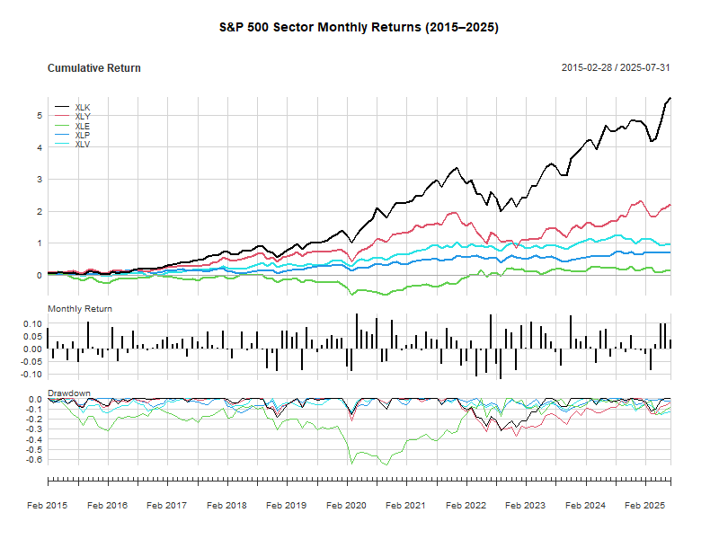
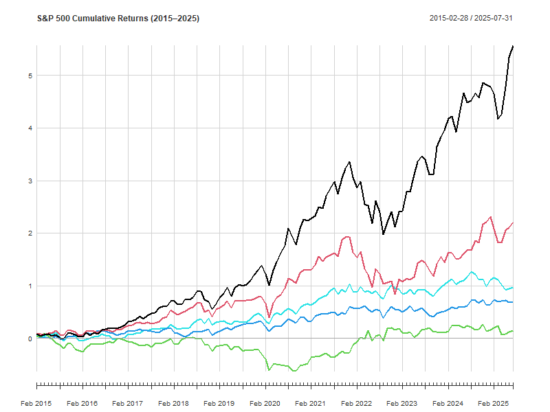
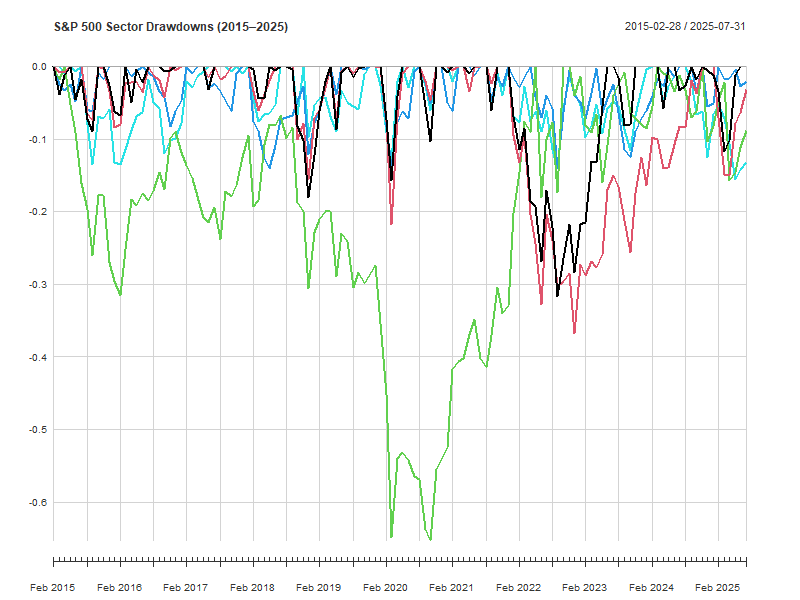

# 📊 S&P 500 Sector Performance Analysis

This project analyzes the performance of S&P 500 sector ETFs (e.g., XLK,
XLE, XLP) from **2015 to July 2025** using monthly return data sourced
from Yahoo Finance.

## 🔍 Overview

We explore: - 📈 Monthly Returns - 📊 Cumulative Performance - 📉
Drawdowns - 🔁 Rolling Volatility *(optional)*

The analysis is performed in **R** using: - `quantmod` -
`PerformanceAnalytics` - `tidyverse`

### 📈 Monthly Returns Chart



### 📈 Cumulative Returns Chart





## 📂 Files

-   `Stock-Sector-Analysis.Rproj`: RStudio project file
-   `stock-sector-analysis.qmd`: Quarto source file
-   `stock-sector-analysis.html`: Rendered report
-   `stock-sector-analysis.pdf`: Printable PDF
-   `README.md`: This overview file

## 📦 How to Run

1.  Open `Stock-Sector-Analysis.Rproj` in RStudio

2.  Install required packages:

    ``` r
    install.packages(c("quantmod", "PerformanceAnalytics", "tidyverse"))
    ```

3.  Open and render `stock-sector-analysis.qmd` (Click **Render**)

## ✍️ Author

**Alex Alvarez**\
MSQE Candidate – San Francisco State University

## 🔁 How to Reproduce

To run this analysis on your own:

1.  Clone the repository: \`\`\`bash git clone
    <https://github.com/alexxx2339/stock-sector-analysis.git>

## 🔗 View the Report

<https://alexxx2339.github.io/stock-sector-analysis/>

### 🧠 Insights Summary

This report analyzes 11 sector ETFs from 2018 to 2025. Technology
outperformed others, while Energy saw higher risk. The COVID-19 dip is
visible across all sectors, with varying recovery speeds.
